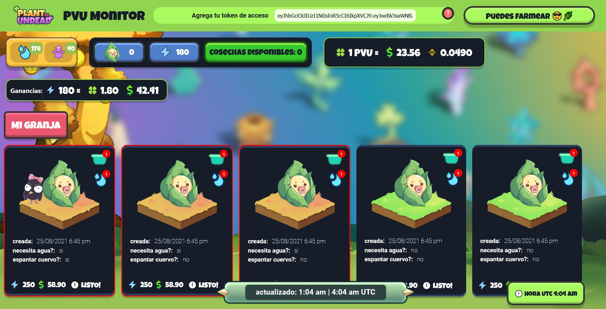

# PVU Farm Monitor

PVU Monitor is an open source tool created to monitor the status of your plants without having to enter the game. PVU Monitor is developed in React and runs completely in the browser, without saving any type of data.

* Available in both, English and Spanish (with i18n) *

### Example



In addition to monitoring your plants, it is also possible (if enabled) to automatically water the plants and repel the crows. It does this by validating the state of the plants in your land every 20 minutes and using the function *checkPlantsStatus()*.

For example, if a plant needs water, the function applies water tool on it and wait 20 seconds to water next plant.

If the request responds with status 556, you need to water manually and solve captcha from web.

```js
if (plant.needWater) {
  const { data, status } = await controller.applyTool(
    tools.WATER,
    plant._id
  
  if (status == 556) alert("manual review required");
  
  if (data?.reward == 0) console.log("success water");

  result.updated.push({
    plant: plant._id,
    tool: "WATER",
    time: new Date(),
    response: data,
  });

  await sleep(20);
}
```

The results of each operation are stored in the local storage. You can visualize those results by adding the query param *bot=true* to the url. 

```
localhost:3000?bot=true
```

### Test

You can use the application with test data by changing the value of the variable "test" to "true" in the api.js file

### `yarn start`

Runs the app in the development mode.\
Open [http://localhost:3000](http://localhost:3000) to view it in the browser.

# Enjoy it!